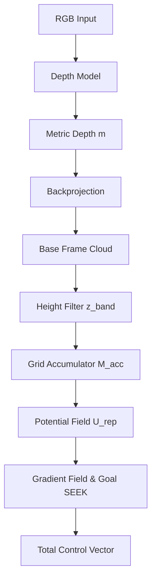

# Perception & Mapping Architecture

This document describes the ROS-free depth-to-potential-field pipeline implemented in `sparx_agency`.

## Overview

The pipeline converts monocular RGB frames into metric depth and then into a 2D occupancy grid with an associated potential field for navigation.

## Core Components

### 1. Depth Estimation (`DepthModel` ABC)
- **Implementations**:
  - `DepthEngineTRT`: TensorRT optimized backend for DepthAnything V3. Handles letterbox inversion to preserve aspect ratio.
  - `DepthAnythingV2DepthModel`: HuggingFace transformer backend (CPU/GPU fallback).
- **Output**: HxW float32 array in metric meters.

### 2. Spatial Mapping (`PotentialMapper`)
- **Coordinates**: Matches C++ reference convention:
  - `X`: Left
  - `Y`: Up
  - `Z`: Forward
- **Accumulation**: EMA-based probability decay:
  - $M_{acc} = (1 - \alpha)M_{acc} + \alpha M_{temp}$
- **Goal Navigation**: Combines a repulsive potential from obstacles with a parabolic attractive potential toward a target coordinate.

### 3. Potential Field (`PotentialFieldLayer`)
- **Repulsive Field**: Computed using a Gaussian falloff from the Nearest-Obstacle Distance Transform.
- **Goal Seeking**: Parabolic attraction $\nabla U_{att} = \zeta (P - G)$.
- **Combined Field**: $\nabla U_{total} = - ( \nabla U_{rep} + \nabla U_{att} )$.

## Default Configuration
- **Resolution**: 10cm cells.
- **Height Band**: 5cm to 2.0m (captures chairs and people).
- **Falloff**: $\sigma = 0.3m$ (keeps standard doorways open).
