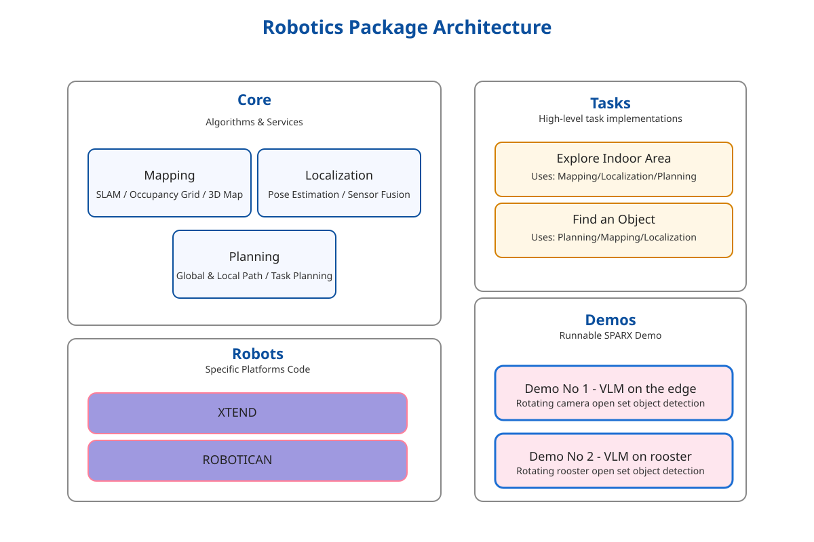

# SPARX Agency

## Overview

The SPARX Agency system is composed of several packages, each of which provides a specific functionality or feature.




### Core Package

The core package contains fundamental components and utilities used across the project. It includes base classes, common
utilities, and core functionality for drone operations.

[Core Package Documentation](sparx_agency/core/README.md)

### Demos Package

Contains demonstration programs and example implementations showcasing various features of the SPARX Agency system.
Useful for learning and testing purposes.

[Demos Package Documentation](sparx_agency/demos/README.md)

### Robots Package

Contains platform specific code for controlling the drone hardware e.g. Xtend, Robotican, etc.

[Interfaces Package Documentation](sparx_agency/robots/README.md)

### Tasks Package

Implementation of specific mission tasks and behaviors that can be assigned to drones, including navigation, mapping,
and coordination tasks.

[Tasks Package Documentation](sparx_agency/tasks/README.md)

## Package Dependencies

- Core: Base package, no dependencies
- Interfaces: Depends on core
- Tasks: Depends on core and interfaces
- Demos: May depend on all other packages

For detailed implementation information, please refer to each package's individual documentation.

### Install ROS dependencies 

```bash
./scripts/install_ros_deps.sh ./ros2_ws
source ./ros2_ws/install/setup.bash
