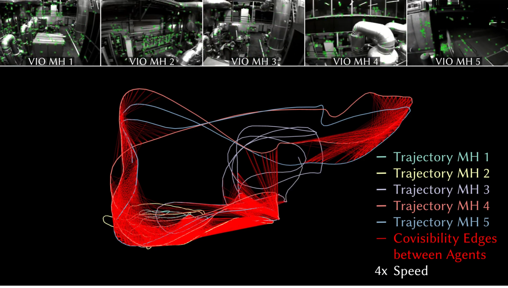
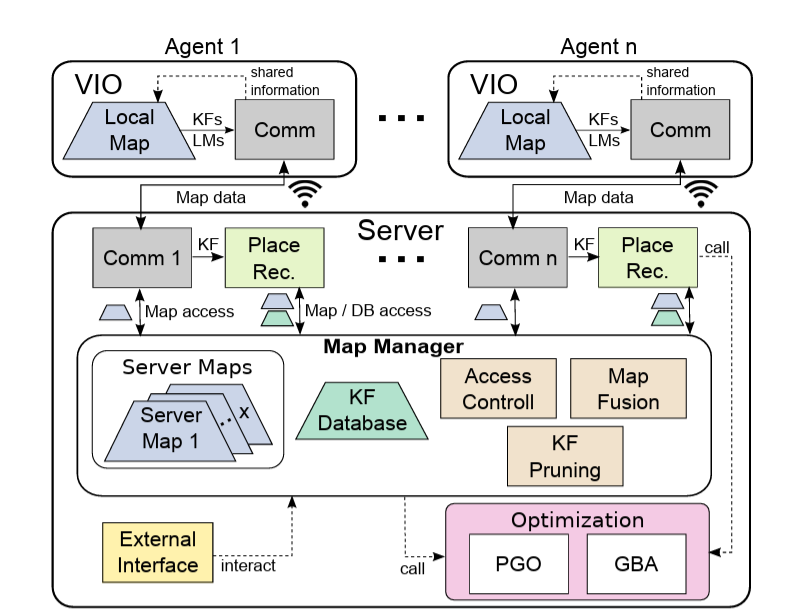

# The Agency
This repo hosts code gatthered and developed for The Agency Project in SPARX.

The aim of this project is to develope group capabilities using drones.

Contents:
1. [Multi Planner](#Multi-Planner)
2. [Multi SLAM](#Multi-SLAM)

## Multi-Planner
See `agency-planner` [documentation](docs/planner/README.md).

## Multi-SLAM

The first task of The Agency is explore and map an unknown indoor enviornment.
The SLAM problem will be solved by multiple agents and this mulkti SLAM shall be done using COVINS.

### COVINS
* [Project](https://asl.ethz.ch/v4rl/research/datasets-code1/code--multi-robot-coordination-for-autonomous-navigation-in-part1.html)
* [Code](https://github.com/VIS4ROB-lab/covins)
* [Paper](https://arxiv.org/abs/2108.05756)

COVINS algorithm acts as a server for several clients preforming ORB-SLAM in the same environment.

An overview of ORB-SLAM3 is given [here](docs/orb_slam_components.md).

