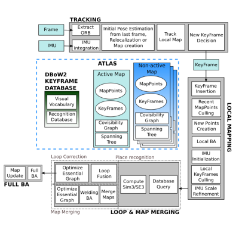

# ORB SLAM3 System Components

This document describes the main components and data structures in the ORB_SLAM3 algorithm based on the paper:

 [ORB-SLAM3: An Accurate Open-Source Library for Visual, Visual-Inertial and Multi-Map SLAM](https://arxiv.org/abs/2007.11898)

## Overview 

## Basic Components

* `Frame` - a single state vector. In the visual-inertial setting the state vector contains:
  * `T` - body pose. SE(3) element.
  * `v` - velocity in world frame
  * `b_g` - gyroscope bias
  * `b_a` - accelerometer bias
* `IMU::Preintegrated` - a raw inertial measurement
* `KeyFrame` - a single tracking decision of coupling observations and 3d points
* `MapPoint` - world positions and their corresponding observations

## Data Structures

* `Map` - a single Map object contains 2 containers:
  * `MapPoint`s vector of the points in the map
  * `Keyframe`s vector of the keyframes that created the map
  * `CovisibilityGraph` - a graph which its nodes are all the keyframes. nodes are connected if the keyframes share some minimum amount of map points
  * `SpanningTree` - a connected subgraph of the co-visibility graph with minimal amount of edges
* `Atlas` - contains a single *active* map and a container of *non-active* maps.

## Algorithms

* `Tracking` - 
  * Extract and match landmarks
  * Estimate position 
* `LocalMapping` -
  * Update the co-visibility graph and the spanning tree
  * Create new map point(s)
  * Map points culling
  * Bundle Adjustment
  * Keyframe culling
* `LoopClosing` -
  * Fuse map points
  * Update co-visibility graph accordingly