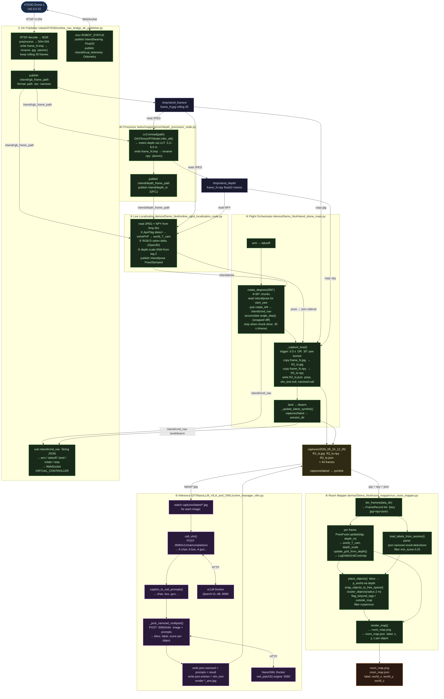
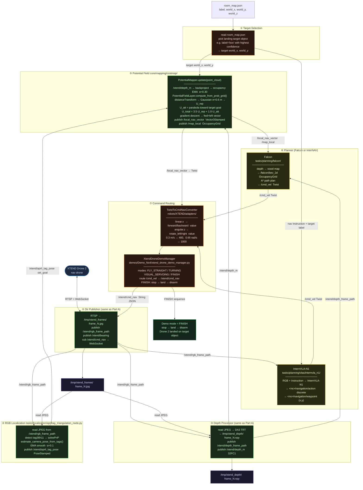

# Demo 4 — Full Pipeline

---

## PART A — Map the Room

---

## PART B — Autonomous Navigation & Landing

---

## Data transport summary

| Signal | Type | Producer → Consumer |
|---|---|---|
| `/xtend/rgb_frame_path` | `String` `"{path} sec nsec"` | Dir Publisher → Depth, Localization, InternNAV |
| `/xtend/depth_frame_path` | `String` `"{path} sec nsec"` | Depth Processor → Localization, Falcon |
| `/tmp/xtend_frames/frame_N.jpg` | JPEG file | Dir Publisher → all readers |
| `/tmp/xtend_depth/frame_N.npy` | NPY float32 | Depth Processor → all readers |
| `/xtend/depth_m` | `Image` 32FC1 | Depth Processor → PotentialMapper |
| `/xtend/bearing` | `Float32` rad | Dir Publisher → Localization |
| `/xtend/pose` | `PoseStamped` | Live Localization → Dome Orchestrator |
| `/xtend/april_tag_pose` | `PoseStamped` | AprilTag Node → PotentialMapper goal |
| `/local_nav_vector` | `Vector3Stamped` | PotentialMapper → cmd routing |
| `/falcon/bev_2d` | `OccupancyGrid` | Falcon BEV → A\* planner |
| `/cmd_vel` | `Twist` | Planner → TwistToCmdNavConverter |
| `/xtend/cmd_nav` | `String` JSON | Demo Manager → Dir Publisher → WebSocket |
