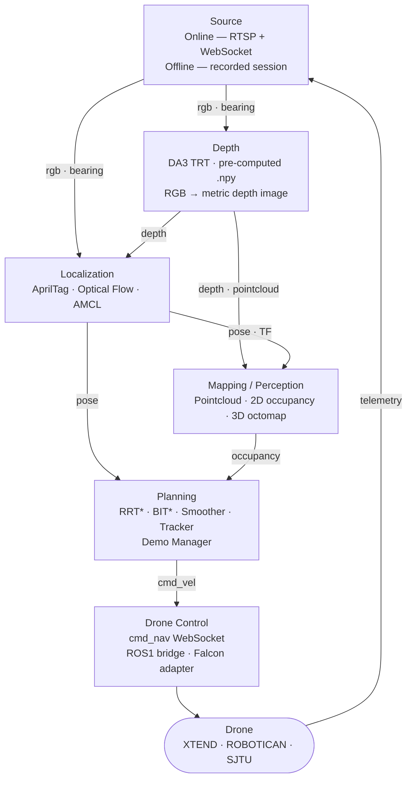

# TheAgency — System Architecture

Paste the Mermaid block into **[mermaid.live](https://mermaid.live)** or into **Draw.io** via
*Arrange → Insert → Advanced → Mermaid* to export as SVG / PNG.

---

