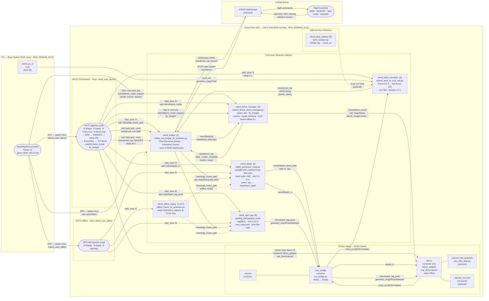

# XTEND Pipeline — rqt_graph Style Flowchart

Source: `sparx_agency/demos/Demo_No4_XTEND_MapRoom/xtend_pipeline_launcher_ui_auto_with_manual_modes.py`

Paste the Mermaid block into **[mermaid.live](https://mermaid.live)** or into **Draw.io** via
*Arrange → Insert → Advanced → Mermaid* to export as SVG/PNG.

---



---

## Legend

| Style | Meaning |
|---|---|
| Solid `-->` | Primary, always-on data flow |
| Dashed `-.->` | Optional / offline-mode path |
| `---` | Same-container grouping (no topic) |

## AUTO startup sequence

```
UI ──SSH──► xtend_auto_launch tmux
               │
               ①  xtend_bridge          waits /xtend/rgb_frame_path
               ②  xtend_depth           waits /xtend/depth_m
               ③  xtend_twist_converter (sleep 2 s)
               ④  xtend_demo_manager    waits /xtend/demo_mode
               │
               ├── ros2 pub /xtend/cmd_nav  ARM
               ├── ros2 pub /xtend/cmd_nav  TAKEOFF
               └── sleep 30 s  (stabilisation)
               │
               ⑥  xtend_april_tag       waits /xtend/april_tag_pose
               ⑧  docker exec falcon  → roslaunch falcon_adapter real_drone.launch
               └── ros2 pub /xtend/demo_mode_request  fly_straight
```

## Key drone parameter chain

```
/cmd_vel (Twist)
  → xtend_twist_converter
    → /xtend/cmd_nav  {action, value}   (linear.x=0.3 → fwd thrust 400, max 600)
      → online_nav_bridge_dir_publisher
        → XTEND WebSocket JSON
          → Flight Controller
```