```mermaid
graph LR

%% ─────────────── COLOUR CLASSES ───────────────
classDef ui        fill:#1e3a5f,stroke:#4a90d9,color:#e8f4fd
classDef hardware  fill:#7b2d00,stroke:#e8693a,color:#fde8d8
classDef vision    fill:#4a1a6b,stroke:#b06ae0,color:#f3e8fd
classDef depth     fill:#1a4a2e,stroke:#4ac97a,color:#e8fdf0
classDef localize  fill:#1a3a5c,stroke:#4ac9c9,color:#e8fdfd
classDef control   fill:#5c3a1a,stroke:#e0a84a,color:#fdf4e8
classDef bridge    fill:#3a3a3a,stroke:#aaaaaa,color:#f5f5f5
classDef planner   fill:#1a1a4a,stroke:#6a6ae0,color:#ededfd
classDef drone     fill:#5c1a1a,stroke:#e04a4a,color:#fde8e8

%% ─────────────── PC BASE STATION ───────────────
subgraph PC["PC — Base Station  (ROS Jazzy · DOMAIN_ID=5)"]
    UI(["XtendPipelineLauncher\nTkinter UI\n192.0.0.89"]):::ui
    PCUI["xtend_pc_ui\nui.py  manual control"]:::ui
end

%% ─────────────── JETSON ORIN AGX ───────────────
subgraph Jetson["Jetson Orin AGX · 192.0.0.89  (ROS Humble · DOMAIN_ID=5)"]

    subgraph FrameSource["Frame Source — one active at a time"]
        Bridge["xtend_bridge\nonline_nav_bridge_dir_publisher.py\nRTSP → saves JPEG → /tmp/xtend_frames\npublishes /xtend/bearing · /xtend/local_telemetry"]:::hardware
        OffReplay["xtend_offline_replay\noffline_frame_dir_publisher.py\n/tmp/xtend_capture → /tmp/xtend_frames  @ 10 Hz"]:::hardware
    end

    Depth["xtend_depth\ndepth_processor_node.py\nDA3METRIC-LARGE FP16  504×294\n÷300 focal scale · clip 0.2–8 m\nsaves .npy → /tmp/xtend_depth"]:::depth

    DemoMgr["xtend_demo_manager\nextend_drone_demo_manager.py\nidle · fly_straight · turning\nvisual_servoing · finish  · disarm 8 s"]:::control

    TwistConv["xtend_twist_converter\nextend_twist_to_cmd_nav.py\nlinear.x=0.3 → fwd thrust 400  max 600\ntimeout 1.5 s"]:::control

    subgraph LocalizationLayer["Localization Abstraction — localization_node.py"]
        LocNode["localization_node\nprovider_type: apriltag OR optical_flow\n─────────────────────────────────\nAprilTagLocalizationProvider\n  tag36h11 · 0.13 m · new_map.yaml\n─────────────────────────────────\nOpticalFlowLocalizationProvider\n  reads RGB + depth files from disk\n  uses /xtend/bearing · /xtend/demo_mode"]:::localize
    end

    subgraph DockerStack["Docker Stack — ROS1 Noetic"]
        RosBridge["ros1_bridge\nrun_bridge.sh\nROS2 Humble ↔ ROS1 Noetic"]:::bridge
        Falcon["falcon  container\nfalcon_adapter\nreal_drone.launch  map:=office\nreads depth .npy files from disk"]:::planner
    end

end

%% ─────────────── XTEND DRONE ───────────────
subgraph DroneHW["XTEND Drone"]
    WS["XTEND WebSocket\n(onboard)"]:::drone
    FC(["Flight Controller\nARM · TAKEOFF · NAV\nLAND · DISARM"]):::drone
end

%% ══════════════════════════════
%% UI CONTROL  (SSH)
%% ══════════════════════════════
UI -->|"SSH: spawn tmux sessions\n(per-item or AUTO sequence)"| Jetson
UI -->|"SSH: ros2 pub\n/xtend/demo_mode_request"| DemoMgr
PCUI -->|"/cmd_vel  Twist"| TwistConv

%% ══════════════════════════════
%% DRONE → BRIDGE  (inbound)
%% ══════════════════════════════
FC -->|"IMU · bearing · telemetry"| WS
WS -->|"RTSP video stream"| Bridge

%% ══════════════════════════════
%% RGB FRAME PATH CHAIN  (file-based)
%% ══════════════════════════════
Bridge -->|"/xtend/rgb_frame_path  String\n(path to JPEG on disk)"| Depth
Bridge -->|"/xtend/rgb_frame_path"| LocNode
Bridge -->|"/xtend/bearing  Float32\n/xtend/local_telemetry  String"| DemoMgr
Bridge -->|"/xtend/bearing"| LocNode

OffReplay -.->|"/xtend/rgb_frame_path\n[offline mode]"| Depth
OffReplay -.->|"/xtend/rgb_frame_path  [offline]"| LocNode

%% ══════════════════════════════
%% DEPTH CHAIN  (file-based)
%% ══════════════════════════════
Depth -->|"/xtend/depth_frame_path  String\n(path to .npy on disk)"| LocNode
Depth -->|"/xtend/depth_frame_path"| RosBridge

%% ══════════════════════════════
%% DEMO MODE
%% ══════════════════════════════
DemoMgr -->|"/xtend/demo_mode  String"| LocNode
DemoMgr -->|"/xtend/demo_mode"| RosBridge
DemoMgr -->|"/xtend/cmd_nav  JSON\nARM · LAND · DISARM"| Bridge

%% ══════════════════════════════
%% LOCALIZATION → ROS BRIDGE → FALCON
%% ══════════════════════════════
LocNode -->|"/xtend/localization  PoseStamped\n/xtend/localization_source  String"| RosBridge
RosBridge -->|"/xtend/localization  PoseStamped  (ROS1)\n/xtend/localization_source  (ROS1)"| Falcon
RosBridge -->|"/xtend/depth_frame_path  (ROS1)\nFalcon reads .npy from disk via path"| Falcon
RosBridge -->|"/xtend/demo_mode  (ROS1)"| Falcon

%% ══════════════════════════════
%% COMMAND FLOW  Falcon → drone
%% ══════════════════════════════
Falcon -->|"/cmd_vel  Twist  (ROS1 Noetic)"| RosBridge
RosBridge -->|"/cmd_vel  Twist  (ROS2 Humble)"| TwistConv
TwistConv -->|"/xtend/cmd_nav  JSON  {action, value}"| Bridge
Bridge -->|"WebSocket JSON  cmd_nav"| WS
WS -->|"flight commands"| FC
```

# XTEND Pipeline — rqt_graph Style Flowchart

Source: `sparx_agency/demos/Demo_No4_XTEND_MapRoom/xtend_pipeline_launcher_ui_auto_with_manual_modes.py`
Localization abstraction: `sparx_agency/tasks/localization/ros2/localization_node.py`

Paste into **[mermaid.live](https://mermaid.live)** or Draw.io via *Arrange → Insert → Advanced → Mermaid*.

---



---

## Legend

| Style | Meaning |
|---|---|
| Solid `-->` | Primary always-on data flow |
| Dashed `-.->` | Offline-mode alternative |

## Architecture notes

**File-based I/O** — RGB frames and depth maps are never published as ROS image topics.
Both are written to disk and only the **file path** travels as a `std_msgs/String` topic.

```
/xtend/rgb_frame_path   → path to JPEG  in /tmp/xtend_frames/
/xtend/depth_frame_path → path to .npy  in /tmp/xtend_depth/
```

**Localization abstraction** — `localization_node.py` is a single ROS2 node that wraps
any `BaseLocalizationProvider`. Regardless of which backend is active (AprilTag, optical flow)
it always publishes the same two topics:

```
/xtend/localization         PoseStamped   (frame_id: world)
/xtend/localization_source  String
```

**Command path**

```
Falcon (ROS1) → /cmd_vel
  → ros1_bridge
  → /cmd_vel (ROS2)
  → xtend_twist_converter
  → /xtend/cmd_nav  {action, value}   linear.x=0.3 → fwd thrust 400, max 600
  → online_nav_bridge_dir_publisher
  → XTEND WebSocket
  → Flight Controller
```

**AUTO startup sequence**

```
UI ──SSH──► xtend_auto_launch tmux
  ①  xtend_bridge          → waits /xtend/rgb_frame_path
  ②  xtend_depth           → waits /xtend/depth_frame_path
  ③  xtend_twist_converter
  ④  xtend_demo_manager
      ARM  →  TAKEOFF  →  sleep 30 s
  ⑥  localization_node     → waits /xtend/localization
  ⑧  docker exec falcon    → roslaunch falcon_adapter real_drone.launch
      ros2 pub /xtend/demo_mode_request  fly_straight
```