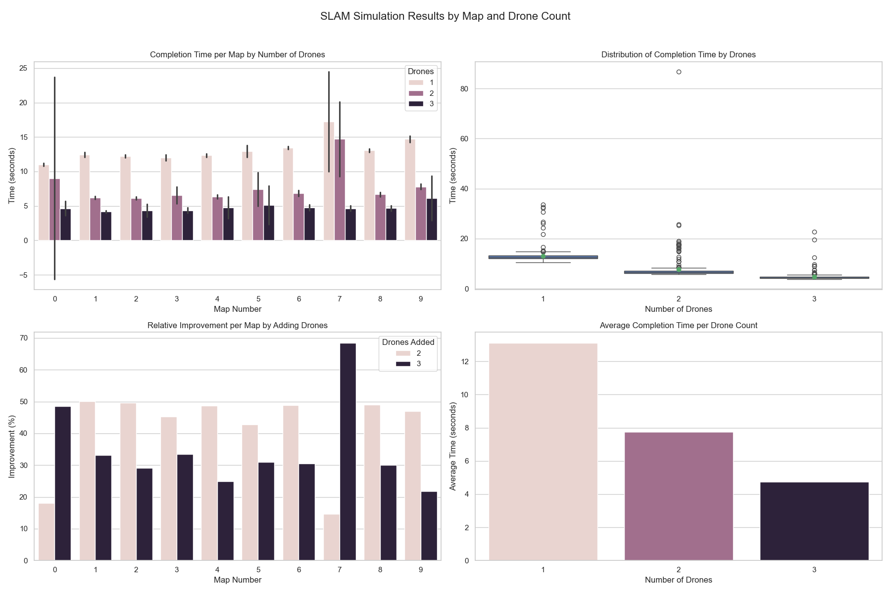

# Multi-Agent SLAM Simulation

This project simulates a team of autonomous drones collaboratively performing SLAM (Simultaneous Localization and Mapping) in a 2D grid-based environment.

Each drone explores the environment, communicates discoveries via a shared interface, and contributes to a centralized global map. The system supports visual and headless simulation modes, multiple planning strategies, and a modular architecture for sensors and communication.

Designed for evaluating the scalability and efficiency of decentralized exploration using multiple autonomous agents.

---
## 🚀 Features

- Modular multi-drone SLAM framework with staggered entry times
- Each drone maintains a **local map**, while contributing to a centralized **global map**
- Pluggable **sensor system**:
  - 360° Bresenham FOV sensor
  - Directional camera sensor
- Abstracted and extensible **communication interface**
- Two planning strategies:
  - Random Walk
  - Frontier-Based Planning (with goal assignment and path memory)
- Centralized **MasterController** for planning and coordination
- Visual simulation via `pygame` with real-time rendering
- **Headless mode** for fast benchmarking and batch evaluation
- Built-in **logging**, **progress tracking**, and **CSV export** of results

---

## 📁 Project Structure

```text
src/
├── planner/
│   ├── algorithm/
│   │   └── naive_planner.py         # Random walk and frontier-based planning strategies
│   ├── communication/
│   │   ├── comm_interface.py        # Abstract interface for drone-controller communication
│   │   └── local_bus.py             # In-memory communication bus implementation
│   ├── docs/
│   │   └── README.md                # Project documentation
│   ├── evaluation/
│   │   ├── benchmark_runner.py      # Run multiple simulations and track performance
│   │   └── analyze_results.py       # Analyze and visualize SLAM results
│   ├── logs/
│   │   ├── slam_run1.log            # Sample log file
│   │   └── slam_results1.csv        # CSV with results from benchmark runs
│   ├── resources/
│   │   ├── maps/                    # Text-based map layouts
│   │   └── outputs/                 # SLAM performance plots and result CSVs
│   │       ├── slam_results.csv
│   │       ├── slam_results_camera.csv
│   │       ├── slam_visualization_grid.png
│   │       └── slam_visualization_grid_camera.png
│   └── simulation/
│       ├── drone.py                 # Drone logic: movement, sensing, communication
│       ├── grid_map_env.py          # Grid-based environment logic and map generation
│       ├── master_controller.py     # Central planner coordinating all drones
│       ├── sim_runner.py            # Main simulation loop and visualization
│       ├── simulation_constants.py  # Constants for directions, tile types, parameters
│       └── sensors/
│           ├── base_sensor.py       # Abstract base class for sensors
│           ├── bresenham_fov.py     # 360° field-of-view sensor
│           ├── camera_sensor.py     # Directional camera-like sensor
│           └── sensor_manager.py    # Combines multiple sensors per drone
```
---

## 🧠 Simulation Overview

1. **Environment Setup**
   - A grid map is either loaded from a `.txt` file or generated randomly with walls, doors, windows, and blackout zones.
   - Drones are placed at designated entry points along the map borders.
   - Each drone is initialized with a unique ID, entry delay, and a set of sensors.

2. **Simulation Loop (per tick)**
   - Each active drone:
     - Receives a movement command from the `MasterController`.
     - Executes the command (move forward, turn, or stay).
     - Uses its sensors to scan the environment.
     - Broadcasts newly discovered tiles back to the controller.
   - The `MasterController`:
     - Aggregates discoveries into the shared global map.
     - Identifies frontiers (boundary of explored/unexplored areas).
     - Assigns new directions or goals to drones based on the planning strategy.

3. **Completion Conditions**
   - The simulation terminates when:
     - **All discoverable tiles** have been explored, or
     - **Maximum allowed simulation time** is reached.

---

## Installation
Clone the repo:
```bash
git clone https://github.com/sparx-mth/TheAgency.git
cd TheAgency
```
and install using `virtualenv` or better using [poetry](https://python-poetry.org/docs/)
### Using `virtualenv`
Create a virtual environment and install the requirements listed in requirements.txt 
```bash
python -m venv venv
source venv/bin/activate
pip install -r requirements.txt
```
### Using `poetry`
Assuming you have poetry installed on your computer, install the enviornment defined in project.toml
```bash
poetry lock
poetry install
```

## 🧪 Run Instructions

### Run full evaluation

```bash
python src/planner/evaluation/benchmark_runner.py
```

or using poetry:
```bash
poetry run benchmark
```
---

### 📊 SLAM Performance Visualization

The following images summarize the SLAM performance across different maps and drone counts:

#### 🔄 360° FOV Sensor Results  
Drones use a 360-degree Bresenham-style sensor to reveal all directions within range.


#### 🎯 Directional Camera Sensor Results  
Drones are equipped with a forward-facing camera that simulates real-world field-of-view constraints.



**Figure Overview:**

1. **Top-Left** – *Completion Time per Map by Number of Drones*:  
   Shows how increasing the number of drones reduces mapping time across maps.

2. **Top-Right** – *Boxplot of Completion Time by Drones*:  
   Highlights the distribution, average, and variance in completion time per drone count.

3. **Bottom-Left** – *Relative Improvement by Adding Drones*:  
   Illustrates how much performance improves when adding more drones (e.g., from 1 to 2, 2 to 3).

4. **Bottom-Right** – *Average Time per Drone Count (Mean ± Std)*:  
   Displays the average mapping time and variability for each number of drones.

---