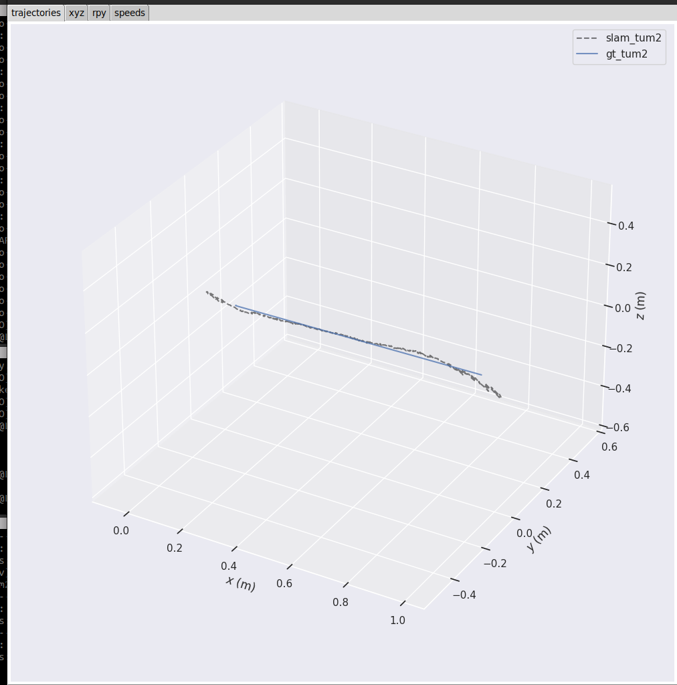
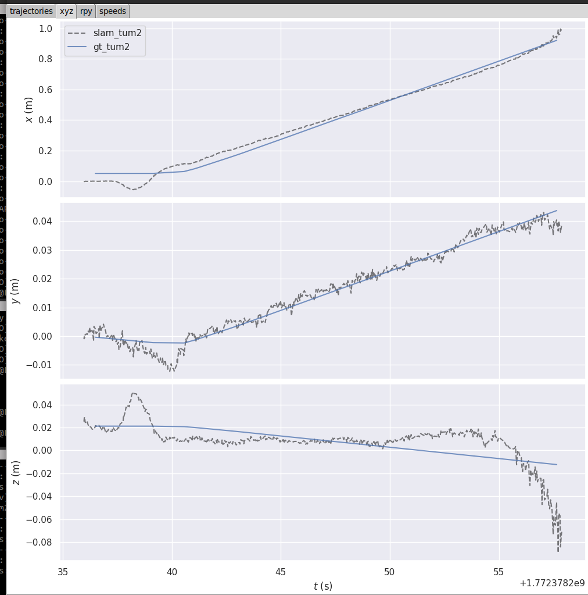
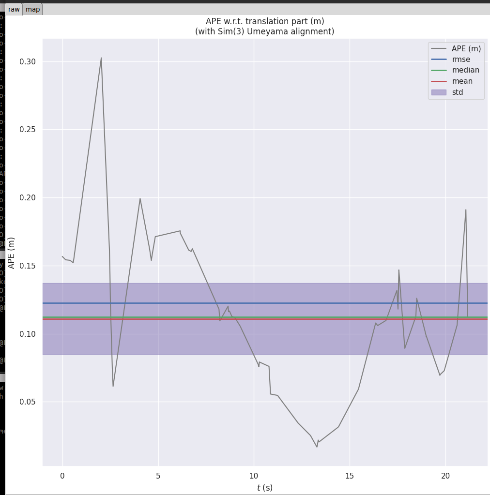
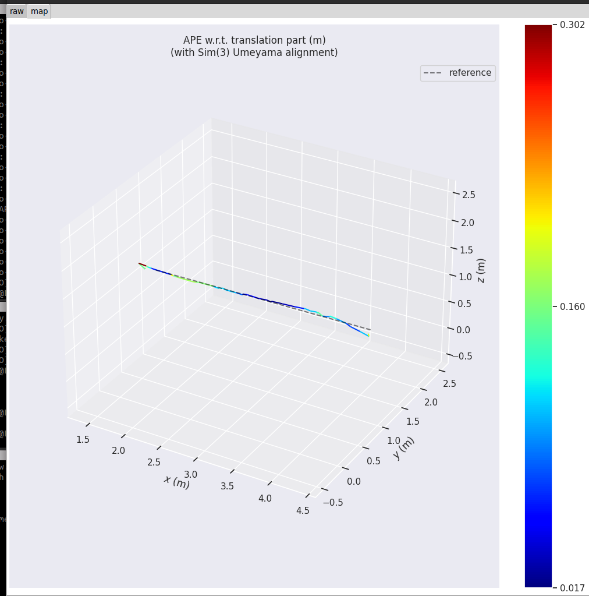

 
 
 
 

 # ORB-SLAM3 Mapping (SJTU Setup)

This document explains how to run the full ORB-SLAM3 RGB pipeline
using:

-   ORB-SLAM3 ROS2 wrapper (Docker)
-   ROS2 rosbag playback

It also includes troubleshooting steps for ROS Domain synchronization
issues.

------------------------------------------------------------------------

# 🧩 System Overview

The system consists of three main components running in parallel:

1.  ORB-SLAM3 (inside Docker container)
2.  ROS2 Bag playback (with simulated clock)

All components must run under the same ROS Domain ID and use
`use_sim_time`.

------------------------------------------------------------------------

# 🚀 Step-by-Step Execution

## 1️⃣ Start ORB-SLAM3 (Docker Container)

``` bash
cd ~/GIT/ORB-SLAM3-ROS2-Docker
sudo docker compose run -e ROS_DOMAIN_ID=0 orb_slam3_22_humble
```

Inside the container:
the launch file is in ORB-SLAM3-ROS2-Docker/orb_slam3_ros2_wrapper/launch/mono_sjtu.launch.py

``` bash
 ros2 launch orb_slam3_ros2_wrapper mono_sjtu.launch.py use_sim_time:=false
```

------------------------------------------------------------------------

## 2️⃣ Start Depth Mapping Task

activate a venv:
``` bash
source .venv/bin/activate
``` 

``` bash
cd ~/GIT/TheAgency
python3 -m sparx_agency.tasks.mapping.create_map_from_video   --ros-args   -p use_sim_time:=true
```

------------------------------------------------------------------------

## 3️⃣ Play the ROS2 Bag (Simulated Time Enabled)

``` bash
cd ~/GIT/TheAgency/sparx_agency/tasks/localization/ros2/depth_optical/bags_files
ros2 bag play rosbag2_2026_01_26-13_29_42/ --clock --rate 0.5
```

Important: - `--clock` is mandatory - `--rate 0.5` slows playback for
stability and debugging

------------------------------------------------------------------------

# 🕒 Simulated Time Requirement

Verify:

``` bash
ros2 param get /robot/ORB_SLAM3_RGBD_ROS2 use_sim_time
```

Expected output:

    True

------------------------------------------------------------------------

# 🧠 Common Synchronization Issues

If: - Topics appear on the host but NOT inside Docker - ORB-SLAM3 prints
"WAITING FOR IMAGE" - TF_OLD_DATA warnings appear - Nodes do not
communicate

Most likely cause:

## ❗ ROS Domain ID mismatch

ROS2 uses DDS Domain IDs for discovery. If the host and Docker container
use different Domain IDs, they cannot see each other.

------------------------------------------------------------------------

# 🔍 How to Check ROS Domain ID

On host:

``` bash
echo $ROS_DOMAIN_ID
```

Inside Docker container:

``` bash
echo $ROS_DOMAIN_ID
```

If values differ, they must be aligned.

------------------------------------------------------------------------

# ✅ How to Fix ROS Domain Issues

When launching Docker, explicitly set:

``` bash
sudo docker compose run -e ROS_DOMAIN_ID=0 orb_slam3_22_humble
```

All terminals (host + container) must use the same ROS_DOMAIN_ID.

------------------------------------------------------------------------

also 

apt update
apt install -y ros-humble-rmw-cyclonedds-cpp


in host and in the container:

export RMW_IMPLEMENTATION=rmw_cyclonedds_cpp
ros2 daemon stop
ros2 daemon start


# 🛠 Useful Debug Commands

Check available topics:

``` bash
ros2 topic list
```

Check clock:

``` bash
ros2 topic hz /clock
```

Check RGB stream:

``` bash
ros2 topic hz /simple_drone/front/image_raw
```

Check depth stream:

``` bash
ros2 topic hz /debug/depth_raw
```

------------------------------------------------------------------------

# 📌 Execution Order

1.  Start ORB-SLAM3 container\
2.  Start depth mapping task\
3.  Start rosbag playback

------------------------------------------------------------------------

If synchronization issues occur, check ROS Domain ID first.