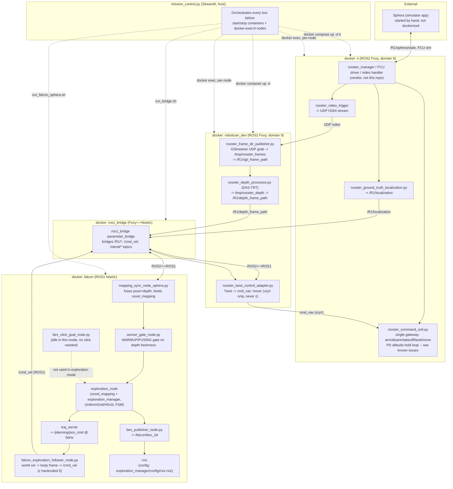

# FALCON exploration mode (`nav_mode:=exploration`)

Flies FALCON's own autonomous frontier-exploration planner instead of following a
BEV-clicked goal — no click needed, it picks where to go on its own.

**Requires the drone to already be airborne and hovering before you start it** — it plans
viewpoints in free 3D space and cannot path to them from the ground. If you skip this it
looks alive (busy computing) but never moves.

> **Handoff note (2026-08-13):** this mode flies and maps correctly, but has one open,
> unresolved bug that affects almost every session — see "Known open issues" below before
> you start debugging something that looks new. Read that section first.

## Architecture — containers and processes



**Reading this:** altitude/attitude control (`rooster_command_unit.py`, inside `it`) is
completely separate from exploration's XY guidance (`falcon_exploration_follower_node.py`,
inside `falcon`) — they only meet at `rooster_twist_control_adapter.py`, which deliberately
drops any `z` a planner's Twist carries (see `rooster_twist_control_adapter.py`'s own
docstring). FALCON never controls height in this stack; the PD loop in
`rooster_command_unit.py` does, on its own, blind to the map.

## Programs to run, in order

**1. Sphera** — the simulator app itself. Started by hand, not from this repo.

**2. `it`** (vendor ROBOTICAN/Sphera backend — FCU driver, `rooster_manager`, video handler):
start it from mission_control's ROBOTICAN tab — **Rooster Sphera Interface Container (it)**
card under "Core" (added 2026-08-13; `▶▶ Launch All` now starts this first automatically).
Manual fallback if the UI itself isn't reachable:
```bash
cd ~/rqs_iai_ws/src && docker compose up -d it
```

**3. `robotican_dev`** (runs Frame Capture / Depth Processor / Twist Control Adapter below —
without this up first, those three fail with `container ... is not running` even though
mission_control looks fine):
```bash
cd /home/user1/GIT/TheAgency && docker compose -f docker-compose.robotican.yml up -d
```
If `/tmp` was freshly cleared (e.g. a reboot today), also run this once — otherwise Frame
Capture crashes on its first frame with `PermissionError` (see `LESSONS.md`):
```bash
sudo chmod 777 /tmp/rooster_frames /tmp/rooster_depth
```

**4. mission_control** (the dashboard everything else runs from):
```bash
cd /home/user1/GIT/TheAgency && venv/bin/streamlit run sparx_agency/tools/mission_control.py
```
Opens at `http://localhost:8501`.

**5. In mission_control, start these services, in this exact order** (wait for each to show
running before starting the next) — or just click **▶▶ Launch All**, which now does this
whole sequence including `it` itself:

1. Rooster Sphera Interface Container (it)
2. Rooster Ground Truth Localization (R1)
3. Rooster Video Trigger (R1)
4. Rooster Command Unit (R1)
5. Rooster Frame Capture (R1) — needs `robotican_dev` already up
6. Rooster Depth Processor (R1) — needs `robotican_dev` already up
7. Rooster Twist Control Adapter (R1) — needs `robotican_dev` already up
8. Rooster Falcon Container
9. Rooster ROS1<->ROS2 Bridge

**6. Arm and take off.** Start **Rooster Manual UI (R1)** from mission_control and use it
(or however you normally fly manually) to arm + take off. Confirm it's hovering before
the next step.

**7. Start exploration.** Start **Rooster Falcon Adapter** from mission_control — it's
already configured with `nav_mode:=exploration`. This launches `exploration_node` →
`traj_server` → `falcon_exploration_follower_node.py`, which takes over `/cmd_vel_raw` and
flies the plan.

To fly a normal click-to-fly mission instead, edit `nav_mode:=exploration` back to
`nav_mode:=astar` in `tools/mission_control.py`'s "Rooster Falcon Adapter" service — it's a
launch-time switch, not something you can flip live.

## Map config: `sphera_jail.yaml`'s `area:` block

FALCON's raw 18-number `map_size` block is derived from a compact `area:` block by the
`mapsize` tool (`sparx_agency/tasks/planning/falcon_pegasus/mapsize/`), applied automatically
by `run_falcon_sphera.sh` before the container starts. Preview what any change actually
produces before flying:
```bash
python -m sparx_agency.tasks.planning.falcon_pegasus.mapsize \
    sparx_agency/tasks/planning/falcon/maps/sphera_jail.yaml
```
Three different z-ranges come out of the same block, and confusing them is exactly what
caused the crash/visualization thrash on 2026-08-13 (see Known open issues):

| Field | Controls | Getting it wrong |
|---|---|---|
| `flight_band` | The exploration/HGrid grid's actual z-bounds — where FALCON is allowed to plan | Too low + altitude drift = **segfault** (drone position falls outside the grid, `UniformGrid::positionToGridCellCenterId` indexes out of range) |
| `vertical_extent` | The full allocated voxel grid (wider, since the camera also sees the floor/ceiling) | Not usually worth touching |
| `visualisation` | **Only** what RViz draws — zero effect on planning/exploration | Safe to tune freely; can't cause the crash above |

If ceiling voxels are cluttering the view, set `visualisation` — **not** `flight_band` — to a
tight box. `flight_band` should stay generous (currently `3.8m`, raised from `1.8`→`2.2`→
`3.8` on 2026-08-13 specifically for segfault margin against the still-open altitude-drift
bug below — see that file's own inline comments for the full history before lowering it
again).

## Known open issues (read before debugging)

**1. Altitude-hold drift, unresolved.** `rooster_command_unit.py`'s PD loop
(`kp=500, kd=600`, `altitude_hold_max_correction` now `380`, was `200`) frequently overshoots
its `target_ranger_m` (currently `1.6m`) by 0.5-1m and sometimes doesn't recover for the rest
of the flight — confirmed live via the raw log (`ranger` oscillating in a band, `z` pinned at
its max-descend clamp continuously, with **zero** net downward trend for 2.5+ minutes at the
old `200` clamp). Raising the clamp to `380` measurably helps (recovers from higher, doesn't
fully converge) but does not fix the root cause. This is entirely independent of FALCON/mapping
— confirmed via code read: `rooster_command_unit.py`/`rooster_unit.py` have **zero** references
to the map or FALCON. See `LESSONS.md`'s 2026-07-22 entry for the original report.

**2. That drift bug is *why* exploration_node keeps crashing.** Every drift excursion above
`flight_band`'s ceiling risks the segfault described in the table above. Raising
`flight_band` (done 2026-08-13, now `3.8m`) reduces frequency but the drift bug can still
occasionally exceed even that. If `exploration_node` dies again shortly after every takeoff,
check the drone's actual height (`rostopic echo /R1/localization`) against `flight_band`
before assuming a new bug — it's very likely this same one.

**3. Restarting `exploration_node` alone is not enough.** `traj_server` is a *separate*
process that survives `exploration_node` crashing. It keeps its own internal trajectory-ID
counter; a freshly-restarted `exploration_node` starts counting from a low number again,
and `traj_server` rejects every new plan as "misordered" (stale) — silently leaving the
drone with zero valid commands ("stuck", not moving, `falcon_exploration_follower`'s
heartbeat shows `holding=True` with a large unchanging `pos_err`). **Restart both together**:
```bash
docker exec falcon bash -lc "pkill -f traj_server"
docker exec -d falcon bash -lc "source /opt/ros/noetic/setup.bash && source /catkin_ws/devel/setup.bash && rosrun exploration_manager exploration_node /odom_world:=/odom_world /voxel_mapping/depth_image:=/map_ros/depth /transformer/sensor_pose_topic:=/map_ros/pose __name:=exploration_node"
docker exec -d falcon bash -lc "source /opt/ros/noetic/setup.bash && source /catkin_ws/devel/setup.bash && rosrun fast_planner traj_server __name:=traj_server"
```
`bev_publisher`/`rviz`/`bev_click_goal_node.py` reconnect to a restarted `exploration_node`
on their own (confirmed live) — only `traj_server` needs the explicit pair-restart.

**4. RViz/`bev_click_goal_node.py` need `DISPLAY=:1`, not the compose default of `:0`.**
`docker-compose.robotican.yml` defaults `DISPLAY` to `:0`, and `mission_control.py`'s
launch commands for RViz/BEV-click hardcode `:0` too — but on this PC the live X session is
actually `:1` (confirmed via `who`/`/proc/<pid>/environ` on a known-good GUI process). `:0`
used to work (a stale greeter/login-screen X session existed there earlier) but stopped
partway through 2026-08-13. If RViz or the BEV-click window fails with
`couldn't connect to display`, override `DISPLAY=:1` explicitly rather than assuming a real
crash — check `who` first, this PC's live display can change across reboots.

**5. Restarting Sphera breaks `rooster_ground_truth_localization.py` silently.** It holds no
reconnect logic — after a Sphera restart it stays alive as a process but stops receiving
`/R1/sphera/state` entirely (confirmed: `ros2 topic hz` on that topic goes to zero). Restart
it explicitly whenever Sphera itself restarts; nothing upstream of it needs touching, but
everything downstream (`mapping_sync`, `object_approach`'s arrival detection, the twist
adapter) is reading a frozen pose until you do. `mission_control`'s bring-up-order note in
the ROBOTICAN tab says the same thing.

## Health checks (copy-paste)

```bash
# Is it actually driving the drone?
docker exec falcon bash -lc "source /opt/ros/noetic/setup.bash && rostopic hz /cmd_vel_raw"

# Follower's own status — the fastest single signal
docker exec falcon tail -n 5 /root/.ros/log/latest/falcon_exploration_follower*.log
#   demo=exploring                    -> mode handoff granted, it owns cmd_vel
#   ref_ready=True                    -> traj_server is publishing a READY trajectory
#   holding=True                      -> no valid/fresh trajectory right now (safe
#                                         default, not a crash) - check exploration_node's
#                                         log next; most likely cause: not airborne yet,
#                                         OR exploration_node/traj_server crashed -- see
#                                         Known open issues #2/#3 before assuming anything else
#   pos_err=<changing> holding=False  -> actively tracking - this is "it's working"

# Is the map actually building? depth=0 stuck at gate=WARMUP means no video reaching
# the pipeline (not a planner bug) - see the fly-rooster-sphera skill's Gotchas
docker exec falcon tail -n 3 /root/.ros/log/latest/mapping_sync-3.log

# Is exploration_node even alive right now? (check this FIRST if voxels look frozen)
docker exec falcon bash -lc "pgrep -af exploration_node"

# Real-time altitude telemetry -- the fastest way to check if issue #1/#2 above is active
docker exec it bash -lc "tail -f /tmp/rooster_command_unit_R1.log" | grep "altitude hold"
```

## Where the logs are

| What | Command |
|---|---|
| Everything (all nodes' console output, incl. `exploration_node`'s FSM/HGrid/TSP lines) | `tail -f /tmp/rooster_planner_adapter.log` |
| `falcon_exploration_follower`'s heartbeat | `docker exec falcon tail -f /root/.ros/log/latest/falcon_exploration_follower*.log` |
| Map fusion health (pose/depth flowing?) | `docker exec falcon tail -f /root/.ros/log/latest/mapping_sync-3.log` |
| `bev_publisher`'s voxel-count heartbeat (frozen counts = `exploration_node` died) | `docker exec falcon tail -f /root/.ros/log/latest/bev_publisher*.log` |
| Altitude-hold PD loop, real-time | `docker exec it tail -f /tmp/rooster_command_unit_R1.log` |

## What's actually running

```
exploration_node (always on, every mode) -> /planning/bspline
  -> traj_server -> /planning/pos_cmd (50Hz)
  -> falcon_exploration_follower_node.py -> /cmd_vel_raw
  -> ros1_bridge -> rooster_twist_control_adapter.py -> rooster_command_unit.py -> FCU
```
`waypoint_follower_node.py` and the A*/NavDP/combination planner nodes are all disabled
in this mode — there's no discrete path, only a continuous trajectory. See the diagram
above for the full container/process picture, including altitude control (which this
chain does **not** touch — `falcon_exploration_follower_node.py` hardcodes `z=0.0` on every
command it sends; height is `rooster_command_unit.py`'s job alone).

For a normal click-to-fly mission (or object approach) instead, see `README_click_to_fly.md`.

See `LESSONS.md` (2026-07-22, 2026-08-10, 2026-08-13 entries) and the `fly-rooster-sphera`
skill for the debugging history behind these.
