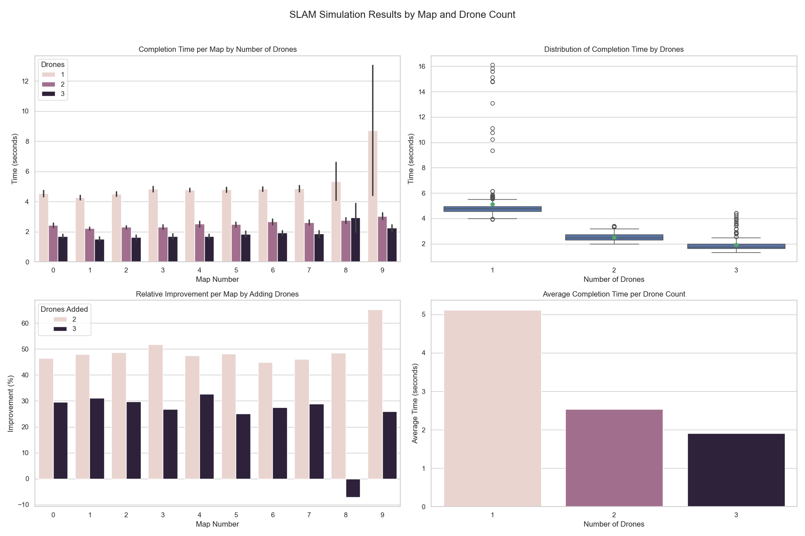

# Multi-Agent SLAM Simulation

This project simulates multiple autonomous drones performing SLAM (Simultaneous Localization and Mapping) in a 2D environment. The drones collaboratively explore the map, communicate their findings, and aim to fully map the environment as efficiently as possible.

---

## 🚀 Features

- Multi-drone SLAM with staggered entry times
- Local map for each drone + centralized global map
- Abstracted communication interface
- Two exploration strategies:
  - Random Walk
  - Frontier-Based Planning
- Visual simulation with `pygame`
- Headless mode for fast evaluation
- Logging and performance tracking across multiple runs

---

## 📁 Project Structure

```text
src/
├── planner/
│   ├── algorithm/
│   │   └── naive_planner.py         # Random walk and frontier planning strategies
│   ├── communication/
│   │   ├── interface.py             # Abstract interface for communication
│   │   └── local_bus.py             # In-memory communication implementation
│   ├── evaluation/
│   │   ├── analyze_results.py       # Analysis and visualization of SLAM performance
│   │   └── benchmark_runner.py      # Script to run multiple simulations and save logs/CSV
│   ├── simulation/
│   │   ├── drone.py                 # Drone behavior, sensing, and broadcasting
│   │   ├── grid_map_env.py          # Environment creation, drone initialization
│   │   ├── master_controller.py     # Central controller: planning and coordination
│   │   ├── sim_runner.py            # Simulation loop and visualization (via Pygame)
│   │   └── simulation_constants.py  # Tile types and movement directions
│   ├── logs/                        # Raw simulation logs and intermediate CSVs
│   │   ├── slam_run1.log
│   │   └── slam_results1.csv
│   ├── resources/
│   │   ├── maps/                    # Static map files (.txt format)
│   │   └── outputs/                 # Visual output (plots, CSV summaries)
│   │       ├── slam_results.csv
│   │       └── slam_visualization_grid.png
│   └── docs/
│       └── README.md                # Project documentation
```
---

## 🧠 Simulation Overview

1. **Environment Setup**
   - Load or generate a map
   - Place entry points along borders
   - Spawn drones at staggered times

2. **Simulation Loop**
   - Master receives updated drone states
   - Master updates global map with new discoveries
   - Master assigns new goals or directions to drones
   - Drones move, sense environment, and broadcast updated state

3. **Completion**
   - Simulation ends when all reachable tiles are discovered
   - Or, when time exceeds timeout threshold

---

## 🧪 Run Instructions

### Run full evaluation

```bash
python src/planner/evaluation/benchmark_runner.py
```

---

### 📊 SLAM Performance Visualization

The following image summarizes the performance of SLAM across different maps and drone counts:



**Figure Overview:**

1. **Top-Left** – *Completion Time per Map by Number of Drones*:  
   Shows how increasing the number of drones reduces mapping time across maps.

2. **Top-Right** – *Boxplot of Completion Time by Drones*:  
   Highlights the distribution, average, and variance in completion time per drone count.

3. **Bottom-Left** – *Relative Improvement by Adding Drones*:  
   Illustrates how much performance improves when adding more drones (e.g., from 1 to 2, 2 to 3).

4. **Bottom-Right** – *Average Time per Drone Count (Mean ± Std)*:  
   Displays the average mapping time and variability for each number of drones.
